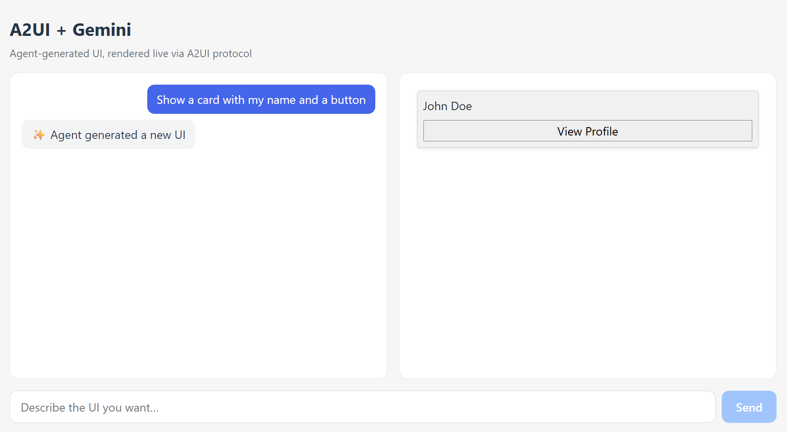

# a2ui-chat-demo — A2UI React Demo

[](https://opensource.org/licenses/MIT)
[](https://react.dev/)
[](https://www.typescriptlang.org/)
[](https://vite.dev/)
[](https://a2ui.org/)
[](https://ai.google.dev/gemini-api/docs)
[](https://pnpm.io/)

> [English](README.md) | **中文**



React 19 + TypeScript + Vite 项目，用于渲染 [A2UI](https://a2ui.org/)（Agent-to-User Interface）生成的 UI，并接入 Gemini 作为真实消息源。

## 技术栈

- [Vite](https://vite.dev/) 8 + React 19 + TypeScript
- [@a2ui/react](https://www.npmjs.com/package/@a2ui/react) — A2UI React 渲染器
- [@a2ui/web_core](https://github.com/a2ui-project/a2ui) — A2UI 核心（消息处理）
- [Gemini API](https://ai.google.dev/gemini-api/docs)（`gemini-3.7-flash`，可配置）
- 包管理器：[pnpm](https://pnpm.io/)

## 快速开始

```bash
# 1. 配置 Gemini API key（免费申请：https://aistudio.google.com/apikey）
cp .env.example .env
# 编辑 .env，填入 GEMINI_API_KEY

# 2. 安装并启动
pnpm install
pnpm dev        # http://localhost:5173
```

在页面输入框里描述想要的 UI（如"创建一个带姓名、邮箱字段和提交按钮的注册表单"），Gemini 会生成 A2UI 协议消息并实时渲染。

```bash
pnpm build      # 类型检查 + 生产构建
pnpm preview    # 预览生产构建
```

## 架构

```
浏览器 (React) ──POST /api/gemini──> Vite dev middleware ──> Gemini API
      │                                      │
      │<────────── A2UI messages ────────────┘
      │
      ▼
MessageProcessor (@a2ui/web_core) → <A2uiSurface> 渲染
```

- `middleware/gemini.ts` — Vite dev 中间件：转发 Gemini 请求，**API key 只存在服务端**，不暴露给浏览器
- `middleware/normalize.ts` — **LLM 输出归一化层**：Gemini 输出的 A2UI 格式常有偏差（`type`/`op`/`action` 消息变体、`props` 嵌套、`componentName` 字段、非法枚举、`checked`→`value`、Button `label`→Text 子组件等），该层将其修复为标准 v0.9 协议消息
- `src/a2uiPrompt.ts` — 引导 Gemini 输出 A2UI 消息的 system prompt（含完整组件 schema 和示例）
- `src/App.tsx` — 聊天输入 + `MessageProcessor` + `<A2uiSurface>` 渲染

## 工作原理

1. 创建 `MessageProcessor`（`@a2ui/web_core/v0_9`），注册 `basicCatalog`
2. 订阅 `onSurfaceCreated` / `onSurfaceDeleted`，把 surface 列表同步到 React 状态
3. 用户输入 → `/api/gemini` → Gemini 生成 A2UI 消息 → 归一化 → `processor.processMessages(...)`
4. 用 `<A2uiSurface surface={...} />`（`@a2ui/react/v0_9`）渲染每个 surface

## 架构设计（生产级 SaaS）

本 demo 是更大模式的一个 POC：**Azure 上由 AI Agent 驱动的对话式 SaaS**。完整设计文档见 [`docs/architecture-design.md`](docs/architecture-design.md) —— 一份通用、与业务无关的设计蓝图（以订餐系统作为贯穿示例）。要点摘录：

### 分层架构

```
┌────────────────────────────────────────────────────────────────────┐
│                        客户端层 (Browser)                           │
│  React SPA：A2UI Renderer（会话 UI）                                │
│            + 常规 React 路由（登录 / 支付 / 设置）                   │
└──────────────────────────────┬─────────────────────────────────────┘
                               │ HTTPS（A2A/SSE/WebSocket 流式）
┌──────────────────────────────▼─────────────────────────────────────┐
│                        边缘层                                       │
│  Azure Front Door (CDN + WAF) + API Management（网关/限流）          │
└──────────────┬──────────────────────────────┬──────────────────────┘
               │ A2A / SSE                    │ REST
┌──────────────▼───────────────┐   ┌──────────▼──────────────────────┐
│  Agent 服务                  │   │  业务 API 服务                  │
│  - 会话管理 (Redis)           │   │  - 确定性领域逻辑               │
│  - 工具调用                  │   │  - 订单/库存/支付状态机          │
│  - A2UI 消息生成             │   │  - 支付回调验证                  │
│  - Catalog 契约 (schema)     │   │                                  │
└──────────────┬───────────────┘   └──────────┬──────────────────────┘
               │ 事件（Service Bus / Event Grid）
┌──────────────▼──────────────────────────────▼──────────────────────┐
│                        数据层                                       │
│  PostgreSQL（订单/用户/菜单）+ Redis（会话/购物车/幂等）              │
└──────────────────────────────┬─────────────────────────────────────┘
                               │
┌──────────────────────────────▼─────────────────────────────────────┐
│                        平台层                                       │
│  LLM（Azure OpenAI / Gemini）· 身份（B2C + Entra ID）               │
│  Key Vault · App Insights / Log Analytics                          │
└────────────────────────────────────────────────────────────────────┘
```

### 关键架构决策（摘要）

| # | 决策 |
|---|---|
| 1 | **A2UI 只渲染会话 UI**；登录/支付/设置保持常规 React |
| 2 | **Agent 独立部署**（生产环境绝不前端直连 LLM） |
| 3 | **确定性逻辑永不进入 LLM** —— 价格/库存/支付在业务服务 |
| 4 | **Catalog 即契约**：小而严格的 Zod schema 组件白名单（起步 6-10 个） |
| 5 | **传输：A2A + SSE 起步**，事件驱动（Service Bus）补实时状态推送 |
| 6 | **多租户从第一天开始**：每个 schema 带 `tenant_id`，共享 Agent + 租户上下文注入 |

### A2UI 消息流（示例）

```
用户: "订一份海鲜披萨，30 分钟后送到"
  │
  ▼
Agent: getMenu("海鲜披萨") → calcDeliveryFee → 生成 A2UI 消息流
  │  createSurface → updateComponents（菜品卡 + 结算表单）
  │  → updateDataModel（菜品、总价、送达时间）
  ▼
前端渲染 → 用户点"确认下单"
  │  action 回传 ──► Agent
  ▼
Agent: createOrder(...) → initiatePayment(...) → 下一轮 UI（状态卡 + 支付按钮）
  │
  ▼
order.paid 事件（Service Bus）──► Agent 推送 updateComponentProperties
  ──► 状态卡响应式更新
```

完整文档还包含：Catalog 设计模式、安全威胁模型（prompt injection / 恶意 UI）、Azure 服务映射、可观测性、演进路线。

## 配置项

| 环境变量 | 默认值 | 说明 |
|---|---|---|
| `GEMINI_API_KEY` | — | 必填，Gemini API key |
| `GEMINI_MODEL` | `gemini-3.7-flash` | 主模型 |
| `GEMINI_FALLBACK_MODELS` | `gemini-3.1-flash-lite,gemini-flash-latest` | 主模型 429/503 时按顺序尝试的备用模型（逗号分隔） |
| `A2UI_DEBUG` | — | 设为 `1` 在服务端打印原始/归一化消息 |

## 已知限制

- 免费 Gemini key 有速率限制（约 20 请求/分钟），连续测试可能遇到 429；稍等重试即可
- LLM 输出归一化已覆盖常见变体，但极端情况下仍可能产生无法渲染的消息（前端会显示错误提示）

## 协议版本

使用 A2UI **v0.9** 协议（新项目推荐），所有导入走 `*/v0_9` 路径。

## 参考

- [架构设计文档（生产级 SaaS）](docs/architecture-design.zh-CN.md) — [English](docs/architecture-design.md)
- [A2UI 官网](https://a2ui.org/)
- [React 渲染器 README](https://github.com/a2ui-project/a2ui/blob/main/renderers/react/README.md)
- [Client Setup 指南](https://a2ui.org/guides/client-setup/)
- [Gemini API 文档](https://ai.google.dev/gemini-api/docs)
